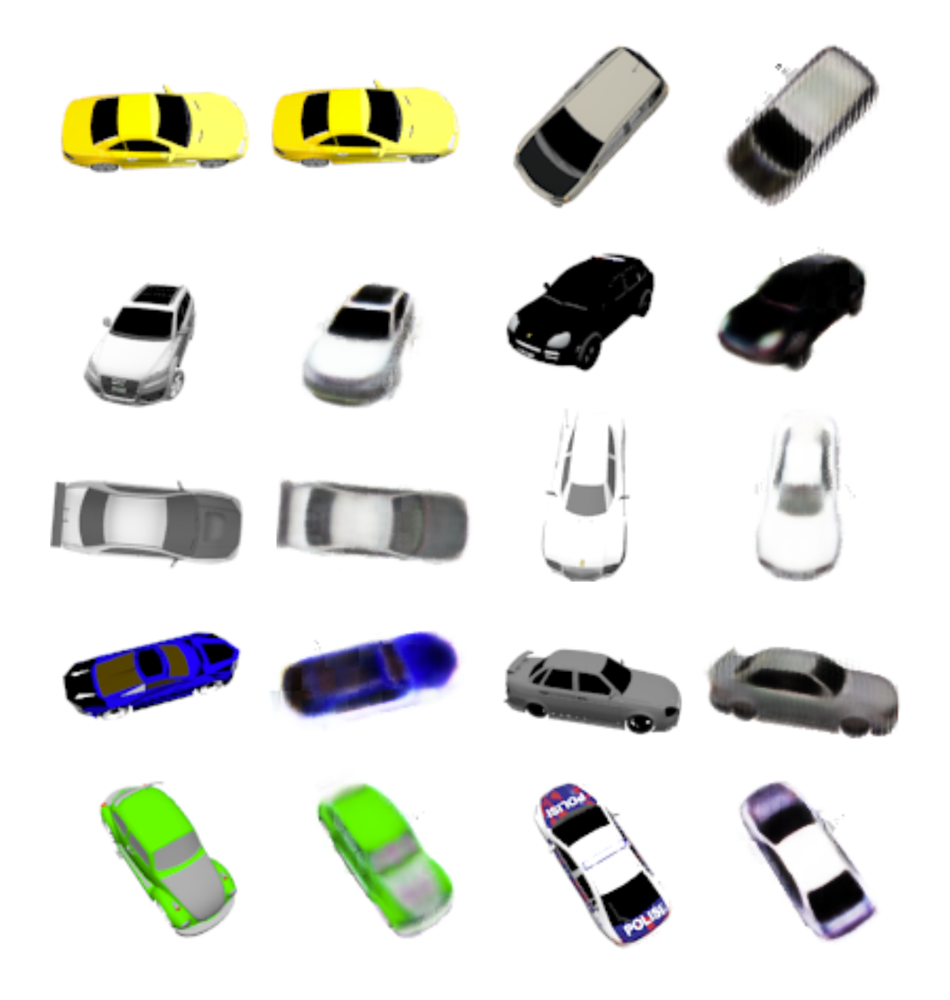
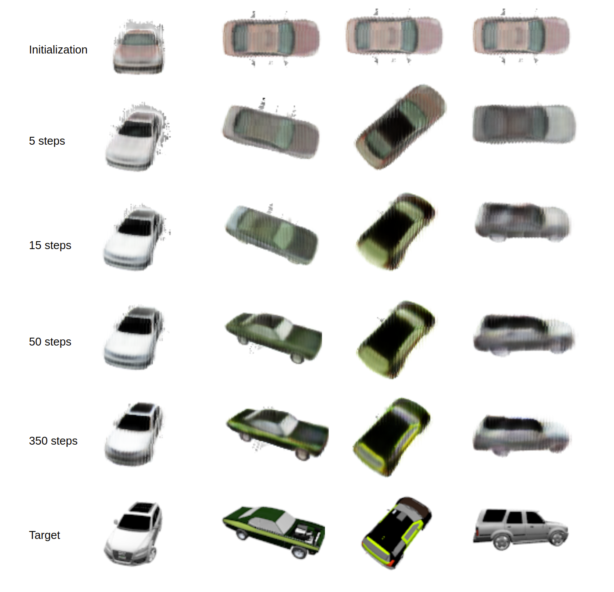

# Code NeRF

Code NeRF is a latent variable auto decoder model that learns the variation in shape and texture of objects in a semantic category.
Unlike NeRF, Code NeRF disentangles shape and texture by learning separate embeddings. The model is also capable of optimizing the camera viewpoint centered around the object.




*Shape and texture embedding optimization*

This project is an unofficial implementation of **Code NeRF: Disentangled Neural Radiance Field for Object Categories**. Since there is no official implementation available, this project may not faithfully reproduce numbers in the paper.


*Camera pose optimization*
## Installation

```
git clone https://github.com/akashsharma02/code-nerf.git
cd code-nerf/
conda env create -f environment.yml
```

## How to run

1. Download the SRN chairs and cars dataset from the original SRN paper: [Google Drive](https://drive.google.com/drive/folders/1OkYgeRcIcLOFu1ft5mRODWNQaPJ0ps90)
2. Modify the configuration or create a new configuration using examples from the `config/` folder.
3. Run the training script (may take a long time)
```
python train.py -c config/srn-cars-code.yml
```
4. Run evaluation script
```
python eval.py -c config/srn-cars-code-3080-eval.yml
```


## Citation

Please cite the following paper and this implementation if you find this useful:
```
@InProceedings{Jang_2021_ICCV,
    author    = {Jang, Wonbong and Agapito, Lourdes},
    title     = {CodeNeRF: Disentangled Neural Radiance Fields for Object Categories},
    booktitle = {Proceedings of the IEEE/CVF International Conference on Computer Vision (ICCV)},
    month     = {October},
    year      = {2021},
    pages     = {12949-12958}
}
```
```
@misc{sharma2022codenerf,
  title={code-nerf},
  author={Akash, Sharma},
  publisher = {GitHub},
  journal = {GitHub repository},
  howpublished={\url{https://github.com/akashsharma02/code-nerf.git}},
  month = {March},
  year={2022}
}
```

